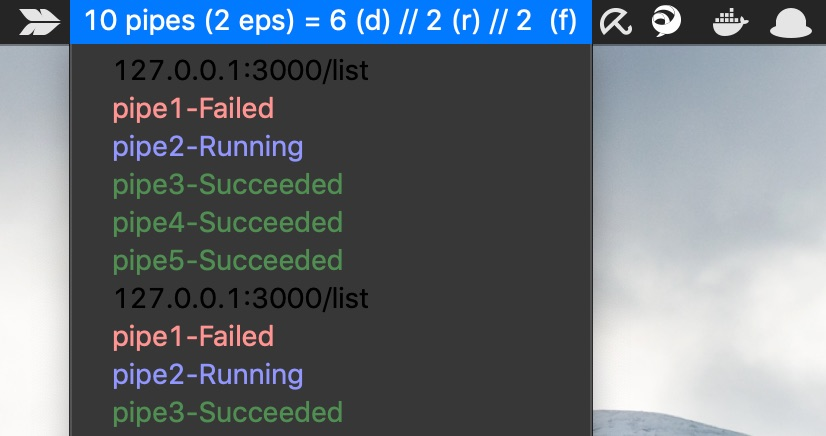

# CP Board

## The Service

The service sends a response of the following structure:

```bash
{"pipe1-cp":{"DeployStage1":"Failed","DeployStage2":"Succeeded","Source":"Succeeded"},
"pipe2":{"ApplyCloudFormation":"Succeeded","Source":"Succeeded"}}
```

It aggregates on the stage level, per Codepipeline configured in the
account the service is running in.

Here's a demo what this looks like if you use the BitBar Plugin:



## To Do

- Implement API filter function (for a specific team for instance)
- Secure access to API in CF template (make a Parameter for CIDR Range of given
  company)
